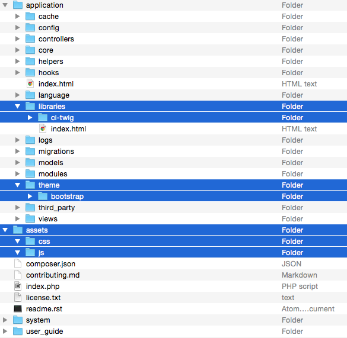
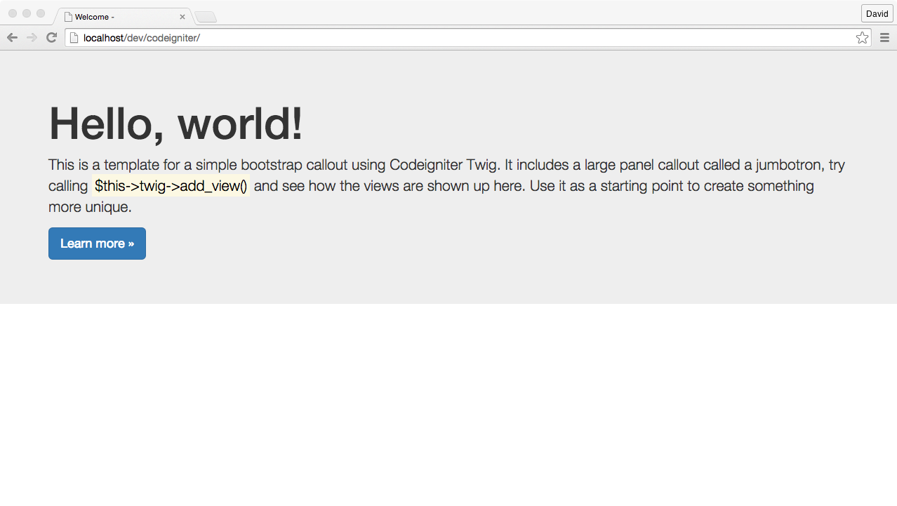
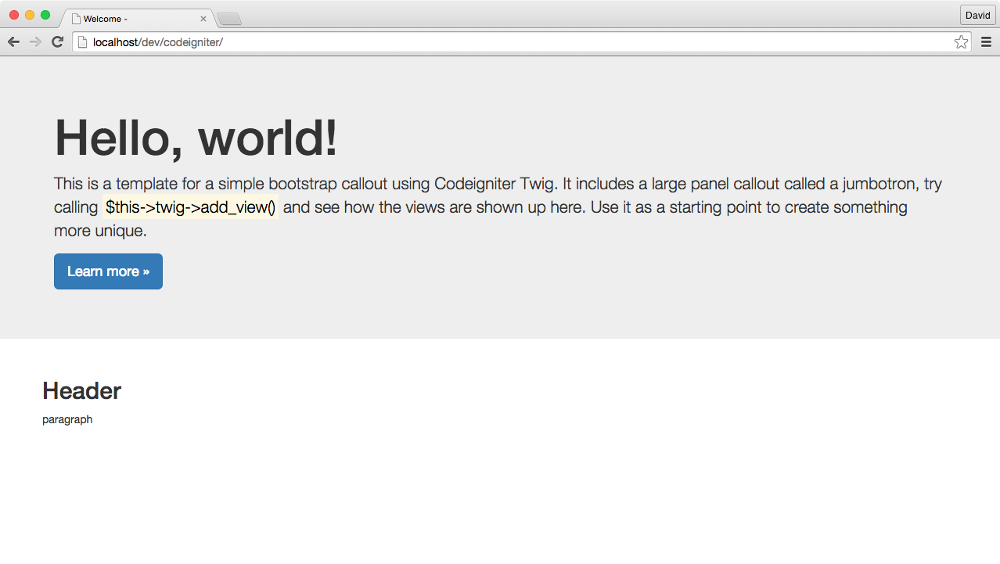

<div style="text-align: center">
	
</div>
# Attire

An implementation of Twig template engine combined with Assetic asset management framework for CodeIgniter 3.0.

---

[](https://packagist.org/packages/dsv/attire) [](https://packagist.org/packages/dsv/attire) [](https://packagist.org/packages/dsv/attire) [](https://packagist.org/packages/dsv/attire)

##Overview

Attire library supports template inheritance using **Twig** template engine and **Assetic** as an asset management framework in **CodeIgniter 3.0**. This integration is used for develop and maintain structured templates, layouts and assets in your application.

---

## Requirements ##

* PHP 5.2.4+
* CodeIgniter 3.x 

---

##Installation

With Composer:

``` bash
composer require dsv/attire 
```
---

##Setting up the environment

Now we need to set the environment where all your templates are stored properly.

### Autoloading composer

Enabling this setting in **application/config/config.php** will tell CodeIgniter to look for a Composer package auto-loader script.

```
$config['composer_autoload'] = 'vendor/autoload.php';
```

###Config File

**Attire** use one config file to retrieve configuration preferences. Copy the **dist/config/attire.php** file inside your config directory:

```
+-APPPATH/
| | +-config/
| | | +-attire.php
```

###Directory structure

Create this directory structure inside your CodeIgniter application:

```
+-APPPATH/
| +-themes/
+-FCPATH 
| +-assets/
| | +-css/
| | +-js/
```

* **APPPATH** is Codeigniter's principal directory, where all your controllers, models and views are placed.
* **FCPATH** is Codeigniter's secured installation directory, where your **index.php** file is placed (normally outside the application directory).

**Note:** you can override the default structure, check the [config guide](#Config_guide) for more details.

###Assets permissions

**Assetics** manage the assets used in every template, so you are gonna need to set the **assets** directory with writable permissions.

###Theme example structure

Install the **Attire Bootstrap** theme with composer:

``` bash
composer require dsv/attire-theme-bootstrap
```

###Before we continue

Let's take a moment to review the initial project that we created and also the library that is already included.



Now you're ready to start working with Attire.

---

##Getting started

Load the library in your controller:

```php
$this->load->library('attire/attire'); 
``` 

Next set the theme and layout:

```php
$this->attire->set_theme('bootstrap');
$this->attire->set_layout('jumbotron');
```
Bootstrap theme includes some layout example structures. 

**Note:** chaining method also supported.

```php
$this->attire->set_theme('bootstrap')->set_layout('jumbotron');
```

<!-- Also create a directory inside the **views** directory with the name of the controller where it will be used. -->
And the last thing that wee need to do is display the theme.

```php
$this->attire->render();
```

###Example

An example using **Attire** in the Welcome Controller:

```
<?php defined('BASEPATH') OR exit('No direct script access allowed');

class Welcome extends CI_Controller 
{
	public function index()
	{	
		$this->load->library('attire/attire');
		$this->attire->set_theme('bootstrap')->set_layout('jumbotron');
		$this->attire->render();
	}
}
?>
```

Let's take a look in the browser:



This is the current output of the render method. Now you can use the **Bootstrap** responsive framework in your application.

---

##Adding views

So far we've only displayed the default template and layout. You can add views to this layout using the **add_view** method.

```php
$this->attire->add_view($view, $params);
```
Where ```$view``` is the view file name and ```$params``` is an array of variables used inside the view interface. It's exactly like the Codeigniter's method: 

```php
$this->load->view($view, $params);
``` 

###Example

Create a view **foo.php** inside the **VIEWPATH** directory:

```html
<!-- application/views/foo.php -->
<h2>Header</h2>
<p>paragraph<p>

```

Next add the view without specifing the directory app and the extension:

```php
<?php defined('BASEPATH') OR exit('No direct script access allowed');

class Welcome extends CI_Controller 
{
	public function index()
	{	
		$this->load->library('attire/attire');
		$this->attire->set_theme('bootstrap')->add_layout('jumbotron');
		$this->attire->add_view('foo');
		$this->attire->render();	
	}
}
?>
```
And this is the output:



And that's how you add views inside your controller's method. Also you can add as many views as you want using the same function multiple times. 

```php
<?php defined('BASEPATH') OR exit('No direct script access allowed');

class Welcome extends CI_Controller 
{
	public function index()
	{	
		$this->load->library('attire/attire');
		$this->attire->set_theme('bootstrap')
					 ->set_layout('jumbotron')
					 ->add_view('foo')
					 ->add_view('fighters')
					 ->render();	
	}
}
?>
```
---

## Theming our application

You don't need to create the same template structure every time a method is called (header, sidebar, breadcrumbs, container, footer, etc), only add the view's you're gonna need in a controller's method. 

```php
<?php defined('BASEPATH') OR exit('No direct script access allowed');

class Welcome extends CI_Controller 
{
	public function __construct()
	{
		$this->load->library('attire/attire');
		$this->attire->set_theme('bootstrap')->add_layout('jumbotron');
	}
	
	public function index()
	{	
		$this->attire->add_view('foo')
					 ->render();	
	}

	public function other()
	{
		$this->attire->add_view('fighters')
					 ->render();		
	}
}
?>
```

Or you can specify your view path and add views in **Twig** style:

```php
<?php defined('BASEPATH') OR exit('No direct script access allowed');

class Welcome extends CI_Controller 
{
    public function __construct()
    {
        parent::__construct();
		$this->load->library('attire/attire');
		$this->attire->set_theme('bootstrap')->add_layout('jumbotron');
    }

	public function index()
	{
	    $this->attire->add_path('<outside-viewpath>','some');
		$this->attire->add_view('@some/foo')
					 ->render();	
	}
}
?>
```

And there you go, adding views to **Attire** is easy as the **CodeIgniter** method's.

---

##Getting help

To get help with **Attire**, please use the discussion group or **GitLab** issues.